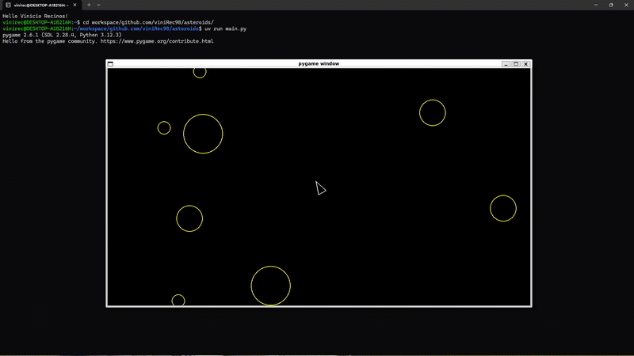

# Asteroids 🚀☄️  

This is an **Asteroids-style** arcade game built with **Python and Pygame**.

You fly a little ship around space, dodge drifting asteroids, and try not to get smashed to bits. The game runs in a classic game loop: every frame it updates positions, checks for collisions, and redraws everything on the screen.

Behind the scenes, the game also logs its state and events (like positions of sprites and actions taken) to JSONL files. Those logs are used for debugging and for automated checks, and you can inspect them yourself with **jq** if you’re curious.


## Gameplay 🎮

- **Move Forward:** `w`
- **Move Backward:** `s`
- **Rotate to the Left (Counter-Clockwise):** `a`
- **Rotate to the Right (Clockwise):** `d`
- **Shooting:** `Spacebar`


## Demo



## Dependencies

- **Python & Pygame** – Run the game and handle graphics/input.
- **uv** – Project/package manager used to install dependencies (like Pygame) and run the game.
- **jq** – Prints and filters the `.jsonl` log files the game produces.


## Getting Started

```bash
git clone https://github.com/viniRec98/asteroids
cd asteroids
uv run main.py